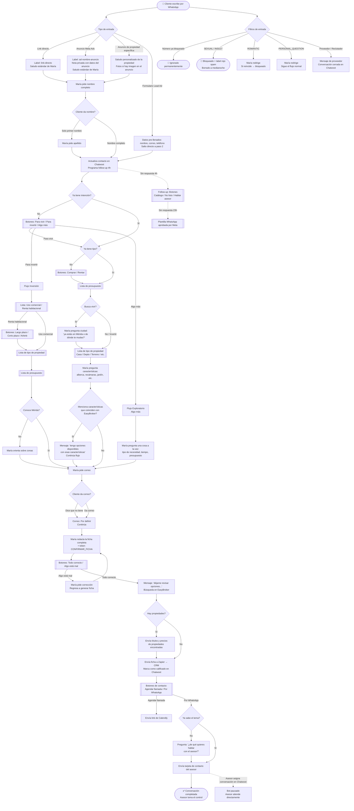

# Flujo de Conversación — Agente TRES65

Abre preview con `Cmd+Shift+V`

---

## Entradas al flujo

| Tipo | Cómo llega | Diferencia |
|------|-----------|------------|
| **Link directo** | Comparte el link de WhatsApp | Label `link-directo`, saludo estándar |
| **Anuncio Meta** | Pica en ad de Facebook/Instagram | Label `ad-{nombre}`, nota con datos del anuncio |
| **Propiedad específica** | Anuncio de una propiedad configurada | Saludo y foto de esa propiedad |
| **Lead Ad** | Llena formulario en el anuncio | Datos pre-llenados, salta directamente al paso 2 |

## Tokens que controlan el flujo

| Token | Qué hace |
|-------|---------|
| `CONFIRMAR_FICHA` | Manda botones de confirmación de ficha |
| `MANDAR_BOTONES_COMPRAR_RENTAR` | Manda botones Comprar / Rentar |
| `MANDAR_BOTONES_VIVIR_INVERTIR` | Manda botones Para vivir / Para invertir / Algo más |
| `MANDAR_BOTONES_CONTACTO` | Manda botones de contacto con asesor |
| `PREGUNTAR_TEMA_ASESOR` | Pide al cliente el tema antes de conectar |
