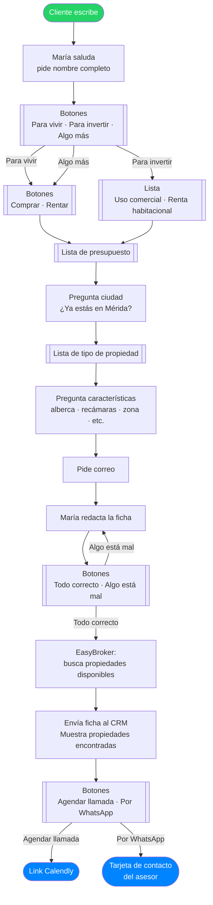

# Flujo TRES65 — Agente María

---

**Entradas al flujo**

| | Diferencia |
|--|--|
| 🔗 Link directo | Saludo estándar |
| 📢 Anuncio Meta | Etiqueta automática del anuncio |
| 🏠 Anuncio de propiedad | Saludo y foto específicos |
| 📋 Formulario Lead Ad | Datos pre-llenados, salta al paso 2 |

**Follow-ups automáticos**

- **4 horas** sin respuesta → botones de retomada
- **23 horas** sin respuesta → plantilla aprobada por Meta
